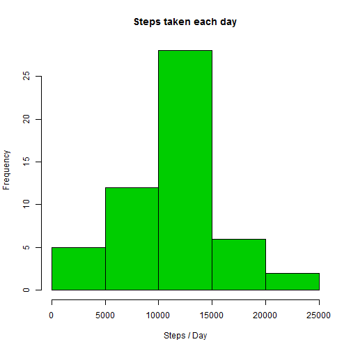
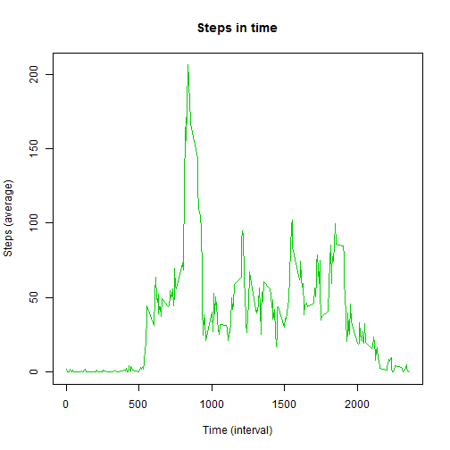
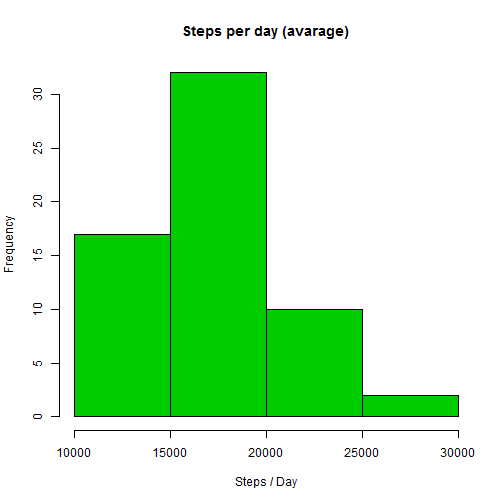
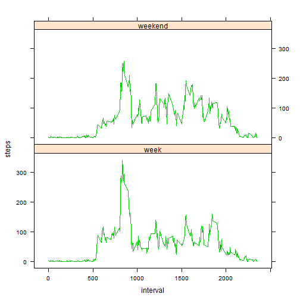

### **Loading and preprocessing the data**

<pre class="knitr r">    acttab &lt;- read.csv(file = &quot;activity.csv&quot;)
    acttab$date &lt;- as.Date(acttab$date)
    acthead &lt;- head(acttab)
</pre>

First 5 rows look like this:

<pre class="knitr r">##   steps       date interval
## 1    NA 2012-10-01        0
## 2    NA 2012-10-01        5
## 3    NA 2012-10-01       10
## 4    NA 2012-10-01       15
## 5    NA 2012-10-01       20
## 6    NA 2012-10-01       25
</pre>

### **What is mean total number of steps taken per day?**

1. Calculate the total number of steps taken per day

<pre class="knitr r">    actcalc &lt;- aggregate(acttab$steps, by = list(acttab$date), FUN = mean)
    actcalc$median &lt;- aggregate(acttab$steps, by = list(acttab$date), FUN = median)[,2]
    names(actcalc) &lt;- c(&quot;date&quot;, &quot;stepavg&quot;, &quot;stepmedian&quot;)
</pre>

2. If you do not understand the difference between a histogram and a barplot, research the difference between them. Make a histogram of the total number of steps taken each day

<pre class="knitr r">    acttab.clean &lt;- acttab[!is.na(acttab$steps),]
    tmp &lt;- aggregate( steps ~ date, acttab.clean, sum )
    hist(tmp$steps, main = &quot;Steps taken each day&quot;, xlab = &quot;Steps / Day&quot;, col= 3 )
</pre>

3. Calculate and report the mean and median of the total number of steps taken per day

<pre class="knitr r">    names(actcalc) &lt;- c(&quot;date&quot;, &quot;stepsmean&quot;, &quot;stepsmedian&quot;)
    head(actcalc)
</pre>

<pre class="knitr r">##         date stepsmean stepsmedian
## 1 2012-10-01        NA          NA
## 2 2012-10-02   0.43750           0
## 3 2012-10-03  39.41667           0
## 4 2012-10-04  42.06944           0
## 5 2012-10-05  46.15972           0
## 6 2012-10-06  53.54167           0
</pre>

### **What is the average daily activity pattern?**

1. Make a time series plot (i.e. type = "l") of the 5-minute interval (x-axis) and the average number of steps taken, averaged across all days (y-axis)

<pre class="knitr r">    acttab.1 &lt;- acttab[!is.na(acttab$steps),] #remove all NA's
    actavg &lt;- aggregate(acttab.1, by = list(acttab.1$interval), FUN = mean)
    plot(actavg$interval, actavg$steps, type = &quot;l&quot;, xlab = &quot;Time (interval)&quot;, ylab = &quot;Steps (average)&quot;, main = &quot;Steps in time&quot;, col = 3)
</pre>

2. Which 5-minute interval, on average across all the days in the dataset, contains the maximum number of steps?

<pre class="knitr r">    maxline &lt;- which.max(actavg$steps) #find max value
    maxvalue &lt;- actavg[maxline, 2] #show max value
</pre>

That would be **<code class="knitr inline">206.1698113</code>** on line **<code class="knitr inline">104</code>**

### **Imputing missing values**

1. Calculate and report the total number of missing values in the dataset (i.e. the total number of rows with NAs)

<pre class="knitr r">    totalNAs &lt;- sum(colSums(is.na(acttab))) #count all NA's
</pre>

Total number of missing values in the dataset is **<code class="knitr inline">2304</code>**

2. Devise a strategy for filling in all of the missing values in the dataset. The strategy does not need to be sophisticated. For example, you could use the mean/median for that day, or the mean for that 5-minute interval, etc.

Strategy: filling missing values with steps mean for the interval.

<pre class="knitr r">    tmp &lt;- acttab
    tmp[is.na(tmp$steps),]$steps &lt;- -1
    tmp$steps2 &lt;- round(actavg$steps)
    tmp$steps &lt;- as.numeric( apply(tmp, 1, function(x) max(x[[1]],x[[4]])))
</pre>

3. Create a new dataset that is equal to the original dataset but with the missing data filled in.

<pre class="knitr r">    acttab.filled &lt;- tmp[, c(1:3)]
    head(acttab.filled, 10)
</pre>

<pre class="knitr r">##    steps       date interval
## 1      2 2012-10-01        0
## 2      0 2012-10-01        5
## 3      0 2012-10-01       10
## 4      0 2012-10-01       15
## 5      0 2012-10-01       20
## 6      2 2012-10-01       25
## 7      1 2012-10-01       30
## 8      1 2012-10-01       35
## 9      0 2012-10-01       40
## 10     1 2012-10-01       45
</pre>

4. Make a histogram of the total number of steps taken each day and Calculate and report the mean and median total number of steps taken per day. Do these values differ from the estimates from the first part of the assignment? What is the impact of imputing missing data on the estimates of the total daily number of steps?

<pre class="knitr r">    daysteps &lt;- aggregate(steps ~ date, acttab.filled , sum)
    hist(daysteps$steps, col = 3, xlab = &quot;Steps / Day&quot;, main = &quot;Steps per day (avarage)&quot;, breaks = 5)
</pre>

<pre class="knitr r">    smean &lt;- mean(daysteps$steps)
    smedian &lt;- median(daysteps$steps)
</pre>

Avarage: **<code class="knitr inline">17050.16</code>**

Median: **<code class="knitr inline">17350.00</code>**

### **Are there differences in activity patterns between weekdays and weekends?**

For this part the weekdays() function may be of some help here. Use the dataset with the filled-in missing values for this part.

1. Create a new factor variable in the dataset with two levels - "weekday" and "weekend" indicating whether a given date is a weekday or weekend day.

<pre class="knitr r">    acttab.filled$weekday &lt;- &quot;week&quot;
    acttab.filled[which(weekdays(acttab.filled$date) == &quot;Sunday&quot; | weekdays(acttab.filled$date) == &quot;Saturday&quot;),]$weekday &lt;- &quot;weekend&quot;
    acttab.filled.avg &lt;- with( acttab.filled, aggregate(steps, by = list(interval, weekday), FUN = mean) )
    names(acttab.filled.avg) &lt;- c(&quot;interval&quot;, &quot;weekday&quot;, &quot;steps&quot;)
</pre>

2. Make a panel plot containing a time series plot (i.e. type = "l") of the 5-minute interval (x-axis) and the average number of steps taken, averaged across all weekday days or weekend days (y-axis). See the README file in the GitHub repository to see an example of what this plot should look like using simulated data

<pre class="knitr r">    xyplot(steps ~ interval | weekday, data = acttab.filled.avg, type = &quot;l&quot;, layout = c(1,2), col = 3)
</pre>

